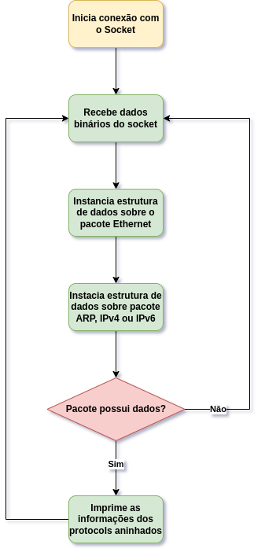

# Python Packet Sniffer

### Gregor Yannis Wey, Marcello Fabrizio

Softwares de visualização de pacotes de rede são ferramentas indispensáveis no estudo de protocolos. Este projeto visa ampliar as funcionalidades do código fonte original, escrito por [Bucky Roberts](https://github.com/buckyroberts/Python-Packet-Sniffer). O projeto orignal teve seu desenvolvimento inciado em 2015, portanto, não contava com o suporte para o portocolo IPv6, entre outros. 

O grupo realizou o "fork" do projeto orignal, e a refatoração do código fonte para permitir uma maior flexibilidade de expansão com novos protocolos e a fácil manutenção. O projeto pode ser encontrado no [GitHub](https://github.com/Marcellofabrizio/Python-Packet-Sniffer).

## Estrutura do projeto

 Foram utilizados conceitos de padrões de projeto para realizar a fatoração. Utilizando a interface "Protocol", da qual todos os protocolos abordados implementam, foi possível tornar a expansão do projeto mais fácil. Os protocolos recebem pelo seu construtor os dados binários do pacote, e seus cabeçalhos são montados utilizando manipulação de bits com a biblioteca [struct](https://docs.python.org/3/library/struct.html) do Python. Um objeto Protocol possui a função `print_data`, que além de mostrar na tela os cabeçalhos do pacote, ele irá chamar a mesma função no protocolo encapsulado, se possuir tal.

### Protocolos utilizados
Os protocolos a seguir são os que já haviam sido implementados no projeto original;
#### Camada 2

- Ethernet
    **Cabeçalhos**
    - Destination
    - Source
    - Protocol

#### Camada 3

- ICMP
    **Cabeçalhos**
    - Type
    - Code
    - Checksum
  
- IPv4
    **Cabeçalhos**
    - Version
    - Header Lenght
    - TTL
    - Protocol
    - Source
    - Target

#### Camada 4

- TCP
    **Cabeçalhos**
    - Source Port
    - Destination Port
    - Sequence
    - Acknowledgment
    - Flags
    - URG, ACK, PSH
    - RST, SYN, FIN
  
- UDP
    **Cabeçalhos**
    - Source Port
    - Destination Port
    - Lenght

#### Camada 5

- HTTP
### Protocolos implementados pela equipe
#### Camada 2

- ARP: O protocolo ARP é fundamental no funcionamento de redes LAN, ajudando a encontrar os endereços IPs através de endereços MAC.
    **Cabeçalhos**:
    - Hardware Type
    - Protocol Type
    - Operation Code
    - Sender MAC Address
    - Sender IP Address
    - Destination MAC Address
    - Destination IP Address

#### Camada 3

- IPv6: Devido a falta de atualização do projeto original, a última versão do programa foi publicada quando ainda haviam endereços IPv4 disponíveis na Internet. Hoje, essa não é mais a realidade. Surgiu então o protcolo IPv6 para substituir a versão anterior. Este protocolo foi a principal adição que o grupo fez ao projeto, já que o tráfego na rede utilizando IPv6 se torna cada vez mais comum.
    **Cabeçalhos**
    - Version
    - Trafic Class
    - Flow Label
    - Payload Size
    - Next Header
    - Hop Limit
    - Source
    - Target
- ICMPv6: O ICMP v6 é a implementaçã do protocolo ICMP para o IPv6, sendo ele uma parte integral para o IPv6, servindo para diagnosticos de redes e relatórios de erros. O Protocolo ICMP v6 possui diversas possíveis mensagens e códigos, sendo eles representados pela classe ICMPV6Messages.
    **Cabeçalhos**
    - Type
    - Type Name
    - Code
    - Code Name
    - Checksum
  
### Fluxo de execução

